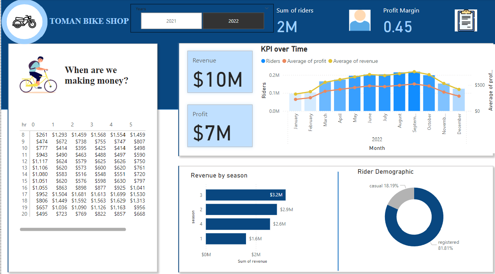

# Sales Report

## Problem Statement
In this project I have created an interactive Power BI dashboard that displays key performance metrics for informed decision making for Toman Bike Share. The dashboard 
visualizes metrics like Hourly Revenue Analysis, Profit and Revenue Trends, Seasonal Revenue and Rider demographics. The purpose of this project is to recommend the raising price for 
the next year.

### Steps followed
1.  Load the data into Microsoft Server Management Studio/ MySQL Workspace, the data are the csv files(bike_share_yr_0.csv and bike_share_csv_1.csv).
2.  Concatenated the three tables (excel files) using 'cte','union' to merge the two bike_share excel files and
    then performed the join operation on the merged bike_share file and the cost_table.
3.  Dropped the duplicate columns after the join operation and added new columns 'Revenue' and 'Profit' using existing columns.
4.  Deleted the rows containing non positive values in numerical columns and deleted duplicated rows to maintain data quality.
5.  Exported this newly created schema and imported it into PowerBI
6.  In PowerBI dashboard, plotted a table that shows the weekly revenue generation by hour.
7.  Plotted a KPI over, that displays the number of riders and the average of revenue generated by month.
8.  Plotted a bar chart that displays the sum of revenue by seasons
9.  Plotted a donut chart that displays rider demographics, number of types of riders, 'Registered' or 'Casual'
10.  Created cards to display the average of revenue, profit, number of riders and profit margin
11.  Added a slicer and set the filter as the year column

   
